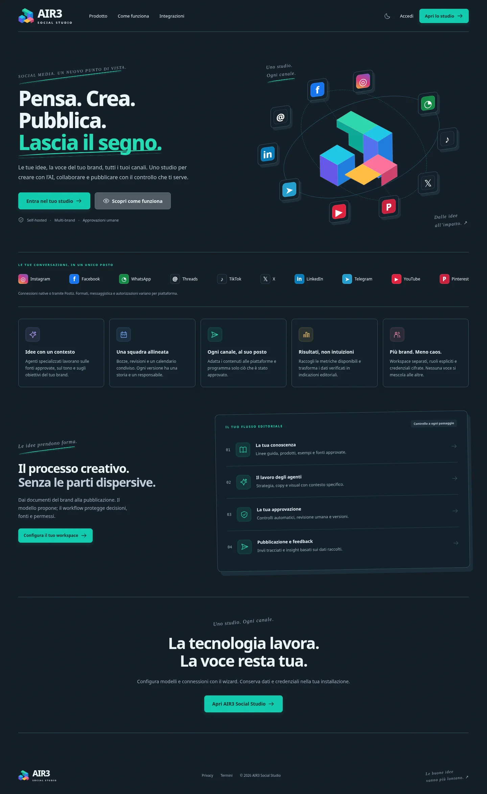
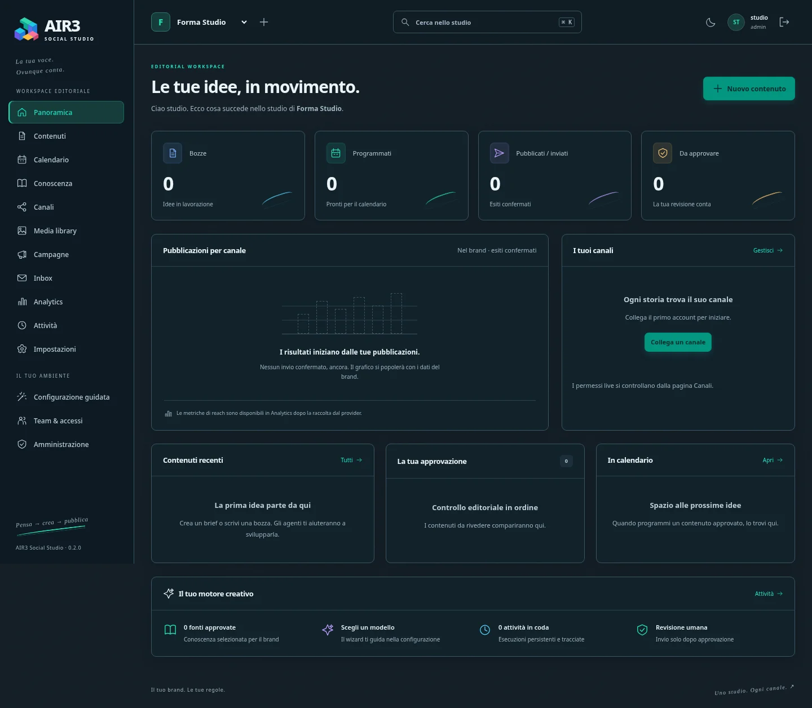
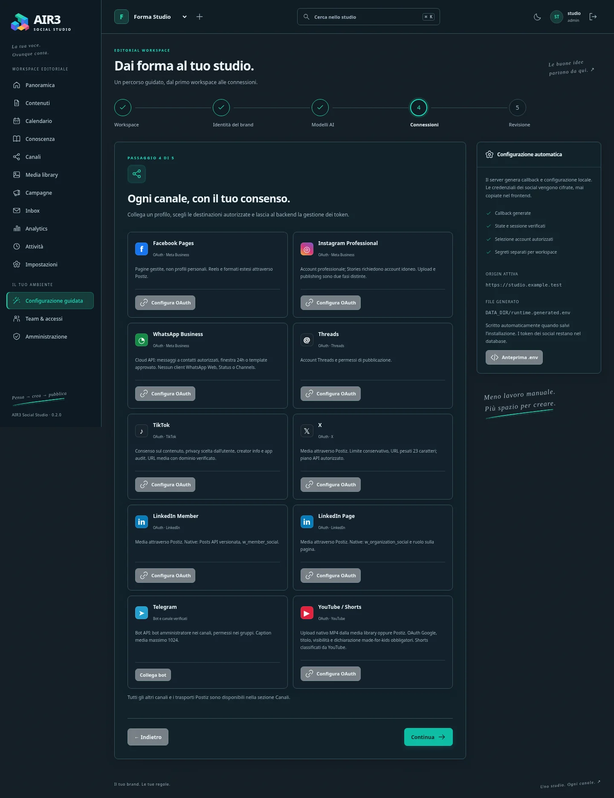
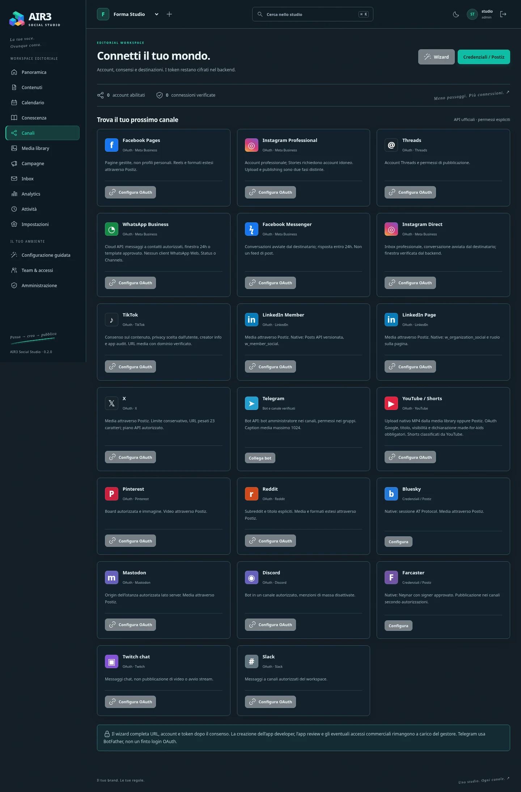
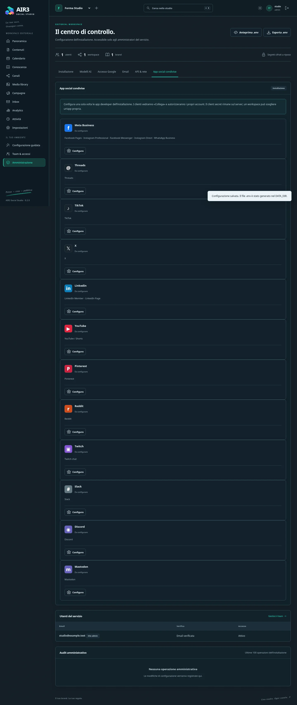
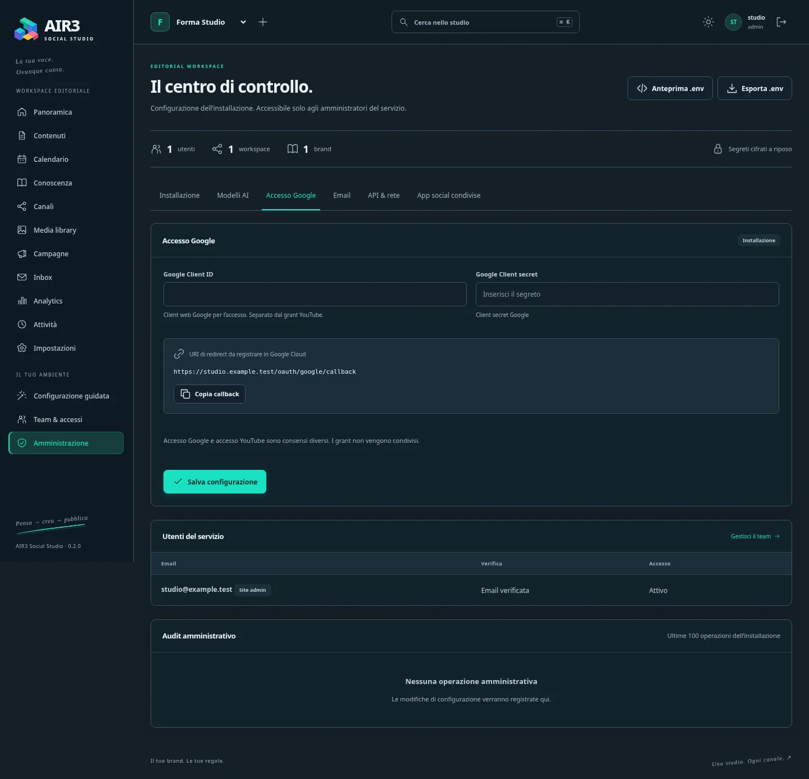
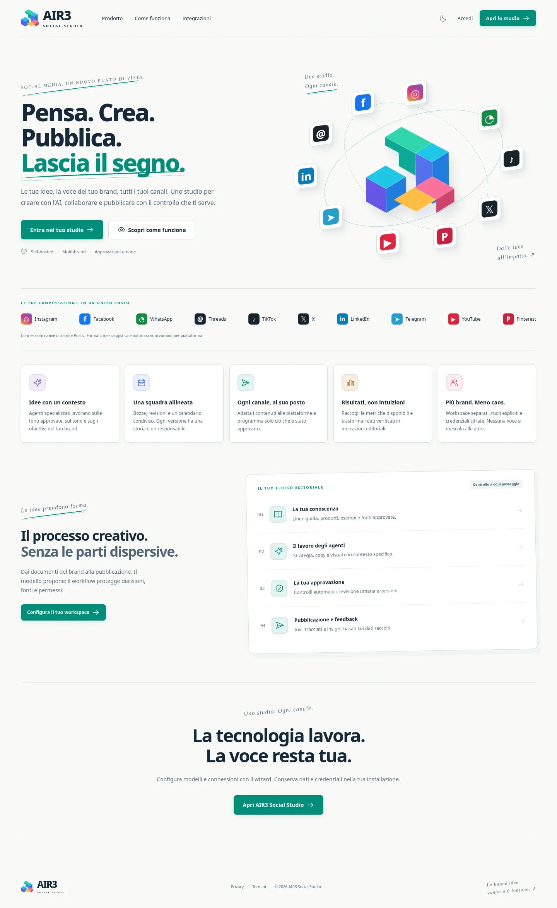

<p align="center">
  
</p>

<p align="center">
  <strong>Think. Create. Publish. Leave your mark.</strong><br>
  <em>Autonomous Multi-Agent Social Media Operations & Brand RAG Intelligence — Enterprise v2.0</em>
</p>

<p align="center">
  <a href="#quickstart"><strong>🚀 Quickstart</strong></a> ·
  <a href="readmeIT.MD"><strong>🇮🇹 Documentazione in Italiano (readmeIT.MD)</strong></a> ·
  <a href="#at-a-glance">At a glance</a> ·
  <a href="#superadmin-access">Superadmin</a> ·
  <a href="#google-login-setup">Google Login Setup</a> ·
  <a href="#bilingual-ui">Bilingual UI</a> ·
  <a href="#architecture">Architecture</a> ·
  <a href="#multi-agent-system">AI Agents</a> ·
  <a href="#channel-hub">Channels & OAuth</a> ·
  <a href="#enterprise-security">Security</a> ·
  <a href="#license">License</a>
</p>

<p align="center">
  
  
  
  
  
  
  
  
</p>

---

> [!NOTE]
> **Italian Documentation**: A complete Italian edition of this document is preserved at [`readmeIT.MD`](readmeIT.MD).

---

## Executive Summary

**AIR3 Social Studio v2.0 (Paper & Graphite)** is an enterprise-grade, self-hosted social media management and brand intelligence platform. Engineered for organizations that require complete operational data sovereignty, zero cloud vendor lock-in, and autonomous editorial deliberation, AIR3 unifies multi-agent AI collaboration, brand memory retrieval (RAG), cryptographic token isolation, and direct multi-channel social publishing into a unified, high-performance ecosystem.

Running entirely on your own infrastructure, AIR3 Social Studio features **zero runtime npm dependencies**, offline-verifiable TypeScript compilation, bilingual internationalization (Italian & English with auto-detection), and encrypted SQLite storage operating under strict WAL journaling.

---

## At a glance

- **Zero Runtime Dependencies** — Built strictly upon the Node.js 22.16+ standard library and native SQLite; eliminates the supply-chain vulnerability surface of external runtime npm packages.
- **Paper & Graphite Design System** — Minimalist editorial aesthetic featuring tactile paper textures, graphite line-art, dark and light palettes, SVG vector branding, and instant mobile responsiveness.
- **Bilingual Interface (IT / EN)** — Native dual-language support with automatic browser language detection (Italian when detected, English fallback for international browsers) and instant manual flag toggle (`🇮🇹 IT` / `🇬🇧 EN`).
- **Autonomous Multi-Agent Council** — Six specialized AI agents (Strategist, Copywriter, Creative Director, Reviewer, Analyst, Planner) debate, refine, and enforce brand guidelines before human editorial approval.
- **Deterministic Brand RAG Engine** — Hybrid lexical (FTS5) and dense semantic embedding retrieval (BGE-M3 / OpenAI / Gemini) grounding every post in verified corporate knowledge and brand assets.
- **Centralized Social Hub & Direct OAuth** — Native publishing support for 20 channel types across 12 social families (LinkedIn, X/Twitter, Meta/Instagram/Threads, YouTube, TikTok, Pinterest, Bluesky, Farcaster, Telegram, Discord, and Postiz).
- **Automated Superadmin Provisioning** — Built-in enterprise role assignment granting total administrative control, multi-workspace governance, and audit visibility to the designated administrator email (configurable via `SUPERADMIN_EMAIL` in `.env`).
- **Automated TLS & HTTPS Ingress** — Secure ingress via modern reverse proxies (such as Caddy or NGINX) terminating HTTPS with zero open inbound firewall ports.
- **Enterprise Security Isolation** — AES-256-GCM token vault encryption at rest, strict SSRF origin verification, constant-work password verification, and tamper-evident audit logs.

---

## Visual Experience

The **Paper & Graphite** interface was designed from the ground up for clarity, precision, and focus. Every view is fully functional, dynamic, and directly bound to the backend REST APIs.

<p align="center">
  
  <em>Executive Overview: Campaign pacing, cross-platform reach, engagement metrics, and pending approval queues.</em>
</p>

<br>

<p align="center">
  
  <em>Editorial Wizard: Multi-channel scheduling, asset synthesis, brand guideline verification, and agent council deliberation.</em>
</p>

<br>

<p align="center">
  
  <em>Account & Channel Governance: Individual workspace connections alongside shared enterprise OAuth apps.</em>
</p>

<br>

<p align="center">
  
  
  <br>
  <em>Left: Centralized enterprise OAuth application vault. Right: Google Identity & OIDC Federation setup.</em>
</p>

<br>

<p align="center">
  
  <em>Adaptive Design: Paper & Graphite light palette and responsive layout optimized for handheld devices.</em>
</p>

---

## Superadmin Access

AIR3 Social Studio v2.0 includes automated administrative role provisioning:

- **Configurable Administrator Identity:** Set `SUPERADMIN_EMAIL=admin@yourdomain.com` in `.env` (or via bootstrap credentials).
- **Privilege Level:** Global Installation Superadmin (`site_admins` authority) + Full Workspace Admin across all active and future workspaces.
- **Auto-Promotion Mechanics:**
  - **Local Authentication:** Logging in or registering with the configured admin email automatically provisions the user with `verified=1`, `disabled=0`, inserts into `site_admins`, and grants `admin` membership on every workspace.
  - **Google OIDC Federation:** When signing in via Google Identity, accounts matching the configured admin email are instantly linked, verified, and elevated to Superadmin without requiring manual database intervention.
  - **Session & Privilege Assertion:** On every session issuance and permission check, `siteAdmin()` unconditionally evaluates to `true`, providing unrestricted access to system telemetry, global OAuth credentials, audit logs, and multi-tenant workspaces.

---

## Google Login Setup

To enable **Sign in with Google** across your deployment:

1. Open the [Google Cloud Console Credentials Page](https://console.cloud.google.com/apis/credentials).
2. Configure the **OAuth consent screen** (User type: *External* or *Internal*).
3. Click **Create Credentials → OAuth client ID** and select **Application type: Web application**.
4. Configure the URIs:
   - **Authorized JavaScript origins:**
     - `https://studio.yourdomain.com` (your public HTTPS domain)
     - *(Optional for local development)*: `http://127.0.0.1:3100`
   - **Authorized redirect URIs (Must match exactly):**
     - `https://studio.yourdomain.com/oauth/google/callback`
     - *(Optional for local development)*: `http://127.0.0.1:3100/oauth/google/callback`
5. Save the generated **Client ID** and **Client Secret**.
6. Supply credentials to AIR3 Social Studio using either method:
   - **Method A (Web Dashboard):** Log in as Superadmin at your deployment URL → navigate to **Administration → Google Sign-In** → enter keys and Save.
   - **Method B (Environment File):** Add them to `.env`:
     ```env
     GOOGLE_CLIENT_ID=your-client-id.apps.googleusercontent.com
     GOOGLE_CLIENT_SECRET=GOCSPX-your-client-secret
     ```
     and restart the server.

Once configured, users can log in with a single click. Any address specified in `SUPERADMIN_EMAIL` (or the initial bootstrap account) automatically receives full Superadmin privileges.

---

## Bilingual UI

AIR3 Social Studio features native **Italian and English** support:

- **Flag Selector**: A discrete flag toggle button (`🇮🇹 IT` / `🇬🇧 EN`) is positioned in the top navigation header next to the Dark/Light theme switch across the public landing page, authentication views, and the internal studio shell.
- **Browser Language Detection**: When a user first opens the application:
  - If the browser language begins with `it` (e.g. `it-IT`, `it-CH`), the interface displays in **Italian**.
  - If the browser language is unidentified or any other language (e.g. `en`, `fr`, `de`), the interface defaults to **English**.
- **Instant Client-Side Switching**: Selecting a language immediately updates all UI labels, navigation menus, command palette entries, modal dialogs, and status badges without losing active application state or requiring a page reload. Choices are persisted in `localStorage`.

---

## Quickstart

### 1. Prerequisites

- **OS:** Linux (Ubuntu 22.04+ / Debian 12+ recommended), macOS, or Docker
- **Runtime:** Node.js 22.16+ (LTS)
- **Media Engine:** FFmpeg & ffprobe (for dynamic carousel and slideshow rendering)
- **System Fonts:** DejaVu Sans / FreeFont (e.g. `apt-get install -y ffmpeg fonts-dejavu-core`)

### 2. Local Setup & Build

All build dependencies (`typescript`, `@types/node`, `undici-types`) are vendored locally in `vendor/` as offline tarballs.

```bash
# 1. Navigate to project root
cd air3-social-studio

# 2. Link offline vendor dependencies & build TypeScript
npm ci --offline --ignore-scripts
npm run build

# 3. Initialize configuration & encryption keys
node scripts/setup.mjs --email admin@yourdomain.com --url http://127.0.0.1:3100

# 4. Start the studio server
npm start
```

Studio binds to `http://127.0.0.1:3100`. The setup script prints the generated Master Encryption Key and temporary initial password.

---

## HTTPS Ingress & Reverse Proxy

AIR3 Social Studio listens on loopback `http://127.0.0.1:3100`. In production, serve HTTPS using any modern reverse proxy (Caddy, NGINX) or secure gateway:

- **Public Endpoint:** `https://studio.yourdomain.com`
- **Internal Upstream:** `http://127.0.0.1:3100`

### Caddy (Automated TLS)

```caddy
studio.yourdomain.com {
    reverse_proxy 127.0.0.1:3100
}
```

### NGINX

```nginx
server {
    server_name studio.yourdomain.com;
    location / {
        proxy_pass http://127.0.0.1:3100;
        proxy_set_header Host $host;
        proxy_set_header X-Forwarded-For $remote_addr;
        proxy_set_header X-Forwarded-Proto $scheme;
    }
}
```


---

## Architecture

AIR3 Social Studio follows a modular monolithic architecture engineered for reliability, deterministic state transitions, and zero operational overhead:

```
                      +------------------------------------------+
                      |       Browser / Mobile Client (ESM)      |
                      |   Paper & Graphite Minimalist Frontend   |
                      |        Bilingual Engine (IT / EN)        |
                      +--------------------+---------------------+
                                           |
                               HTTPS / WSS (Port 443)
                                           |
                      +--------------------+---------------------+
                      |       HTTPS Ingress / Reverse Proxy      |
                      |          studio.yourdomain.com           |
                      +--------------------+---------------------+
                                           |
                                Local Loopback (Port 3100)
                                           |
                      +--------------------+---------------------+
                      |        AIR3 HTTP / REST API Core         |
                      |   Rate Limiting - Auth - CSRF - Router   |
                      +---------+----------+----------+----------+
                                |          |          |
         +----------------------+          |          +----------------------+
         v                                 v                                 v
+------------------+             +-------------------+             +------------------+
|  Multi-Agent AI  |             |  Brand RAG Engine |             | Channel Hub &    |
|     Council      |             | FTS5 + Embeddings |             | Social Gateways  |
| Strategist       |             | Document Chunker  |             | Meta, X, LinkedIn|
| Copywriter       |             | Similarity Search |             | YouTube, TikTok  |
| Creative Dir     |             | Knowledge Vault   |             | Telegram, Discord|
| Reviewer/Analyst |             +---------+---------+             | Postiz / n8n MCP |
+--------+---------+                       |                       +--------+---------+
         |                                 |                                |
         +---------------------------------+--------------------------------+
                                           |
                      +--------------------+---------------------+
                      |      Storage & Security Subsystem        |
                      |  SQLite 3 WAL + AES-256-GCM Key Vault   |
                      |    Audit Logs & Tamper-Evident State     |
                      +------------------------------------------+
```

---

## Multi-Agent System

Content is never generated blindly. AIR3 coordinates an editorial deliberation protocol across six specialized agents:

1. **The Strategist** — Analyzes campaign goals, target demographics, historical performance metrics, and content timing.
2. **The Copywriter** — Drafts channel-native copy adhering to length limits, hashtags, and tonal nuances.
3. **The Creative Director** — Specifies visual framing, color balance, typography overlays, and media templates.
4. **The Reviewer** — Enforces compliance against brand safety rules, prohibited terms, and regulatory claims.
5. **The Analyst** — Interprets downstream engagement, sentiment signals, and audience retention.
6. **The Planner** — Coordinates editorial calendars, scheduling dependencies, and multi-channel publication waves.

All agent reasoning can be inspected in real time or collapsed for executive review.

---

## Channel Hub & OAuth Support

AIR3 provides native support for both individual workspace credentials and centralized administrator-managed OAuth applications:

| Platform Family | Integration Type | Features Supported |
|---|---|---|
| **LinkedIn** | Direct REST v2 / OAuth 2.0 | Text, Single Image, Carousel, Articles, Analytics |
| **X / Twitter** | API v2 PKCE / OAuth 1.0a | Tweets, Threads, Media Upload, In reply to |
| **Meta (Instagram / FB)** | Graph API / OAuth 2.0 | Feed Posts, Reels, Carousels, Stories, Insights |
| **Meta (Threads)** | Official Threads API | Posts, Media attachments, Replies, Metrics |
| **YouTube** | Data API v3 / OAuth 2.0 | Community Posts, Video Shorts, Metadata |
| **TikTok** | Content Posting API | Video Publishing, Privacy Controls, Status checks |
| **Pinterest** | API v5 / OAuth 2.0 | Pin creation, Board selector, Rich media |
| **Bluesky** | AT Protocol / App Passwords | Rich text, Facets, Embedded cards, Blob upload |
| **Farcaster** | Neynar / Hub Signers | Casts, Frames, Embeds, Channel routing |
| **Telegram** | Bot API | Messages, Channels, Groups, Rich photo/video |
| **Discord** | Webhooks / Bot API | Rich embeds, Channel routing, Attachments |
| **Postiz** | Unified Gateway API | Multi-tenant delegation, Fallback channel driver |

---

## Enterprise Security

- **Cryptographic Isolation:** Access tokens, refresh tokens, and API secrets are encrypted using AES-256-GCM before storage. Decryption occurs strictly in-memory at the point of dispatch.
- **SSRF Immunity:** Outbound HTTP requests to external LLMs, webhooks, and social APIs are validated against an allowlist. Private RFC1918 addresses and link-local metadata endpoints are strictly blocked unless explicitly authorized in `ALLOWED_SSRF_ORIGINS`.
- **Zero Token Leakage:** Authentication cookies use `HttpOnly`, `SameSite=Lax`, and `Secure` attributes. Master encryption keys are strictly isolated from SQLite database backups.
- **Session Hardening:** 12-hour maximum session lifetimes with mandatory constant-work password hash verification.

---

## Verification & Testing

The test suite validates runtime behavior, security boundaries, and social provider contracts:

```bash
# Run complete test suite (115 tests)
npm test

# Run end-to-end integration flows
npm run test:e2e

# Run social provider contract tests
npm run test:social

# Verify web assets and build bundle
npm run check
```

---

## Documentation

Comprehensive operational, architecture, and API guides are available in the [`docs/`](docs/) directory:

- [Architecture & Data Flow](docs/ARCHITECTURE.md)
- [Design & Paper & Graphite Aesthetic](docs/DESIGN.md)
- [OAuth & Provider Setup Guide](docs/OAUTH.md)
- [Model Configuration & Local LLMs](docs/MODELS.md)
- [Production Deployment & Docker](docs/DEPLOYMENT.md)
- [Operations, Backup & Migrations](docs/OPERATIONS.md)
- [REST API Reference](docs/API.md)
- [Social Clients & Capabilities Matrix](docs/SOCIAL_CLIENTS.md)
- [Security Model & Disclosure](SECURITY.md)
- [Verification & Test Results](docs/VALIDATION.md)
- [Italian Documentation (readmeIT.MD)](readmeIT.MD)

---

## License

Copyright © 2026 0xfunboy. All rights reserved.

This project is licensed under the terms of the **0xfunboy Non-Commercial License Version 1.1**.

- Non-commercial, academic, and evaluation use is freely permitted.
- Commercial operation, SaaS redistribution, and enterprise deployment require explicit written authorization from the copyright holder.

For complete license terms, refer to [LICENSE.md](LICENSE.md) and [LICENSING.md](LICENSING.md).
